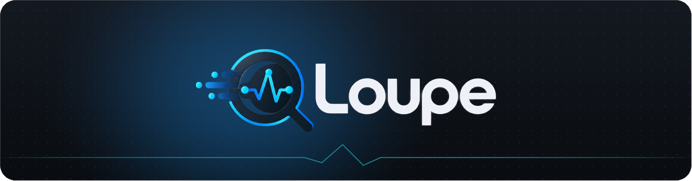
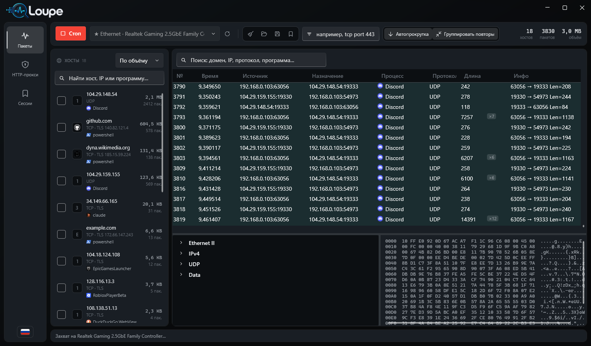
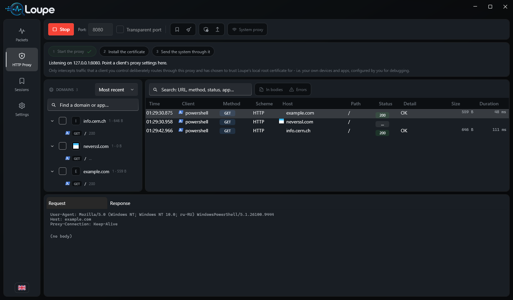
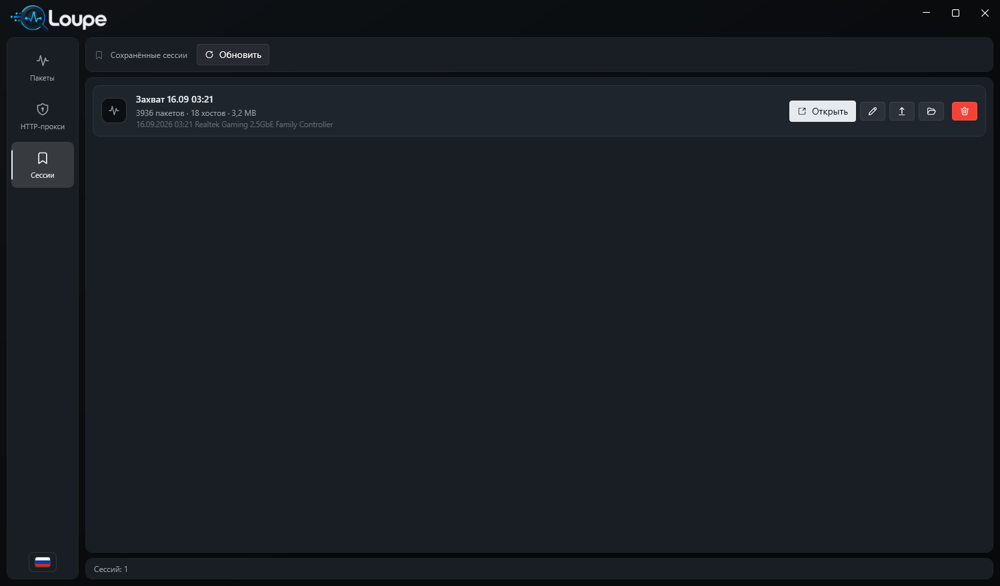

<div align="center">



<h3>Видно, что на самом деле говорит ваша машина.</h3>

Сетевой инспектор для Windows: захват пакетов, который показывает домены и
программы за ними, и HTTP(S)-прокси, который показывает запросы в открытом виде.


[English](README.md) · **Русский**

</div>

---

<div align="center">

</div>

## Чем отличается

Большинство сниферов показывают адреса. Loupe отвечает на два вопроса, которые
возникают при взгляде на них.

**Что это за сайт?** Имена берутся из самого трафика — A/AAAA-записи в ответах
DNS, SNI из TLS-рукопожатия, заголовки `Host` — и подставляются везде, где иначе
был бы голый адрес. Обратные запросы к DNS не делаются: PTR называет хостинг, а
не сайт, а спрашивать резолвер про каждый адрес из захвата — значит слить ему
содержимое захвата.

С QUIC то же самое. Его Initial-пакеты защищены ключами, которые выводятся из
connection ID по соли, опубликованной в RFC 9001, — это защита от
промежуточных устройств, а не секретность, — поэтому Loupe их расшифровывает и
читает ClientHello. Именно так трафик HTTP/3, а это большая часть браузерного,
получает имена вместо безликого «UDP порт 443».

**Какая это программа?** Таблицы владельцев TCP- и UDP-сокетов Windows
связывают локальный порт с процессом, поэтому у каждого пакета и каждого
проксированного запроса есть программа-отправитель со своей иконкой. Самый
громкий хост перестаёт быть `104.29.148.54` и становится Discord.

## Захват пакетов

- Ethernet II, ARP, IPv4/IPv6, TCP/UDP, ICMP/ICMPv6, DNS, открытый HTTP,
  TLS-записи и QUIC с расшифровкой Initial-пакетов.
- Сборка TCP-потоков по соединениям: сегменты не по порядку, переполнение
  32-битного sequence (RFC 1982).
- Панель хостов сворачивает захват по доменам — фавиконка, объём, число пакетов,
  протоколы и программы. При 50 000 пакетов за полминуты сама сетка нечитаема, а
  эта панель остаётся спокойной.
- Отмечайте галочками сколько угодно хостов, чтобы сузить список до них; ищите по
  домену, адресу, протоколу, программе или сводке; шумные — скрывайте насовсем.
- Серии одинаковых пакетов сворачиваются в одну строку с бейджем `×420`.
  Свёрнутые кадры сохраняются, поэтому в записанном `.pcap` остаются все пакеты.
- Чтение и запись классического `.pcap` — захваты открываются в Wireshark и
  tcpdump.

## HTTP(S)-прокси

<div align="center">

</div>

Отладочный прокси в духе Charles/Fiddler/Proxyman, организованный по доменам:
выбираете хост — видите его запросы, открываете запрос — видите заголовки и тело
с форматированным JSON и распакованными `gzip`/`deflate`/`br`.

Чтобы здесь появился браузер, должны выполниться три условия, и страница
показывает, какие из них уже выполнены:

1. **Запустить прокси** — по умолчанию слушает `127.0.0.1:8080`.
2. **Установить сертификат** — добавляет локально сгенерированный корневой
   сертификат Loupe в хранилище вашего пользователя Windows (без прав
   администратора; Windows покажет собственный запрос). До этого ничего не
   расшифровывается.
3. **Направить систему в него** — одна кнопка включает пользовательский прокси
   Windows, либо направьте туда одно приложение вручную.

При остановке прокси (и при выходе) Loupe возвращает настройку как было: если
оставить Windows смотреть в неработающий прокси, машина останется без сети.

**Не только браузер.** Многие программы игнорируют системный прокси. Отдельный
прозрачный порт принимает обычные соединения без всякого `CONNECT`: куда идти,
определяется по TLS SNI или заголовку `Host`. Всё, что можно туда направить —
настройкой самой программы, записью в hosts, правилом фаервола — перехватывается
так же.

Сертификат сервера проверяется как обычно: клиент этого сделать уже не может,
поэтому проверка на стороне прокси — единственное, что осталось.

## Сессии

<div align="center">

</div>

Сохраните то, что на экране, как именованную сессию и вернитесь к ней позже: по
папке на сессию, внутри обычный `.pcap` — он открывается в Wireshark, читать его
через Loupe не обязательно — и запросы прокси вместе с телами. Переименование,
«показать в папке», экспорт, удаление (спрашивает подтверждение и называет, что
именно удаляет).

Экспорт — в форматах, которые понимают другие инструменты: **HAR 1.2** для
запросов (открывают Proxyman, Charles и Chrome DevTools) и сырой `.pcap` для
захватов.

## Как запустить

**Скачать**

Каждую версию с тегом собирает и публикует CI на странице
[Releases](../../releases/latest):

| Файл | Для чего |
|---|---|
| `Loupe-<версия>-win-x64.zip` | Любая Windows 10/11 x64 — распаковать и запустить `Loupe.exe` |
| `Loupe-<версия>-win-x64-net8.zip` | Если уже стоит [.NET 8 Desktop Runtime](https://dotnet.microsoft.com/download/dotnet/8.0) — архив намного меньше |

Рядом лежит `SHA256SUMS.txt` с контрольными суммами. При запуске Loupe
запрашивает права администратора: без них сетевой адаптер для захвата не открыть.

**Требуется**

- Windows 10/11.
- [Npcap](https://npcap.com/#download) — драйвер захвата. Если его нет, Loupe при
  старте предложит скачать официальный установщик и запустит его как обычный
  дочерний процесс; вы увидите родной мастер Npcap и примете его лицензию.
  В комплект он не входит (лицензия не разрешает распространение) и молча
  никогда не ставится.
- Для сборки: [.NET 8 SDK](https://dotnet.microsoft.com/download), Visual Studio
  2022 или Build Tools с рабочей нагрузкой C++ и
  [Npcap SDK](https://npcap.com/#download), распакованный в
  `third_party/npcap-sdk/` либо указанный через `NPCAP_SDK_DIR`.

**Сборка**

```bash
build.cmd
```

Одна команда из любой консоли: находит MSBuild через `vswhere`, собирает
нативную библиотеку захвата, собирает управляемые проекты и прогоняет тесты.
Результат — `src\Loupe.App\bin\Release\net8.0-windows\Loupe.exe`.

`dotnet build Loupe.sln` **не работает**: CLI `dotnet` не умеет обрабатывать
`.vcxproj`. Ровно поэтому и существует `build.cmd`.

**Тесты**

```bash
dotnet run --project tests\Loupe.Tests -c Release
```

Проверкам не нужны ни Npcap, ни сеть: диссектор работает на собранных
вручную кадрах, прокси — на локальном сервере с побайтово заданными ответами,
расшифровка QUIC — на эталонном пакете из RFC 9001 Appendix A.2, а привязка
сокетов к процессам — на настоящих таблицах Windows через loopback.

## Клавиши

| | |
|---|---|
| `Ctrl` + `S` | сохранить текущую страницу как сессию |
| `Ctrl` + `F` | перейти в поиск |
| `Ctrl` + `L` | очистить список |
| `F5` | обновить список сессий |

Интерфейс на 12 языках, переключается на лету флагом внизу панели навигации.

## Где хранятся данные

`%LOCALAPPDATA%\Loupe` — сохранённые сессии, список скрытого, кеш фавиконок,
корневой сертификат прокси и выбранный язык.

## Чего здесь намеренно нет

Пассивной расшифровки **чужого** HTTPS — то есть в тракте захвата, без прокси в
цепочке. Приличный инструмент не должен делать это лёгким, а при TLS 1.3 это
обычно и невозможно без ключей, которыми конечная точка сама поделилась. Если
такое появится, то ровно как в Wireshark: через `SSLKEYLOGFILE`, который пишет
клиент под вашим контролем. Никакого извлечения ключей и никаких чужих сессий.

Прокси видит только тот трафик, который клиент под вашим контролем сам туда
направил и который доверяет сгенерированному сертификату, — ваши собственные
устройства и приложения, настроенные вами. Закреплённые сертификаты (pinning)
по-прежнему его отвергнут, и это правильно.

## Архитектура

```
Npcap (драйвер ядра)
  └─ Loupe.Native    C++  pcap_loop, BPF-фильтры, плоский extern "C" ABI
      └─ Loupe.Capture  C#   адаптеры, сессия захвата, сокет → процесс
          └─ Loupe.Core     C#   разбор, сборка TCP, имена, .pcap, сессии

Loupe.Proxy   C#   корневой CA, сертификаты на хост, CONNECT и прозрачный
                   перехват, релей HTTP/1.1, экспорт HAR

Loupe.App     C#   WPF + WPF-UI
```

Нативный слой нужен затем, чтобы BPF-фильтрация и цикл захвата шли без
управляемых накладных расходов на каждый пакет: переход в C# происходит только
когда кадр готов. Всё, что выше, — обычный C#.

## Лицензия

MIT, см. [LICENSE](LICENSE).
